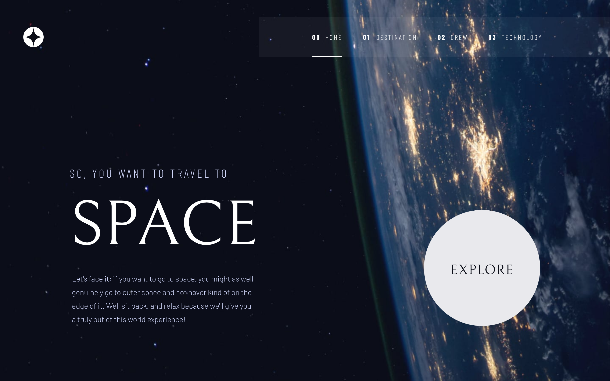
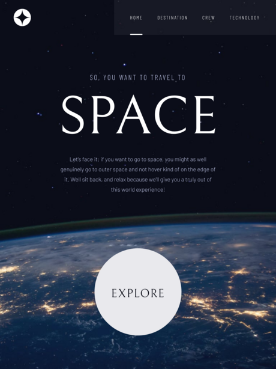
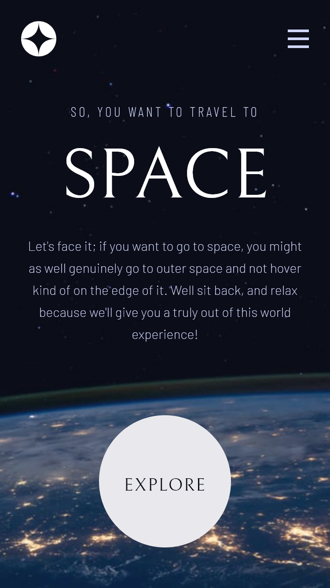

# Space Tourism

[Link to site](venusy.github.io/space-tourism/)

A multi-page site about space and space exploration with a clean, intuitive 
user interface. Users can find facts and statistics about celestial bodies, 
significant figures in space exploration, and relevant technologies.

This site was built with React and Sass.

## Preview

### Desktop Preview

### Tablet Preview

### Mobile Preview

